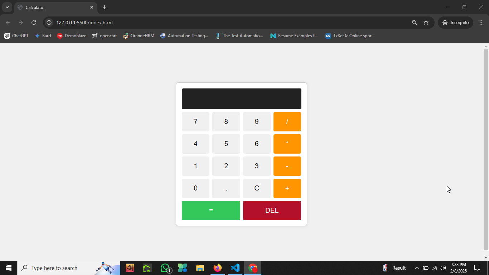

# Calculator Project

A simple and interactive calculator built using **HTML**, **CSS**, and **JavaScript**. This project is designed to perform basic arithmetic operations like addition, subtraction, multiplication, and division.

 <!-- Add a screenshot if available -->

---

## Features
- **Basic Operations**: Perform addition, subtraction, multiplication, and division.
- **Clear Functionality**: Clear the input field with a single button.
- **Responsive Design**: Works seamlessly on both desktop and mobile devices.
- **User-Friendly Interface**: Simple and intuitive design for easy use.

---

## Technologies Used
- **HTML**: For structuring the calculator layout.
- **CSS**: For styling and making the calculator visually appealing.
- **JavaScript**: For implementing the calculator's logic and functionality.

---

## How to Use
1. **Open the Calculator**:
   - Open the `index.html` file in your web browser.
2. **Perform Calculations**:
   - Use the buttons to input numbers and operators.
   - Click the `=` button to see the result.
3. **Clear Input**:
   - Press the `C` button to clear the input field.

---

## Installation
To run this project locally, follow these steps:

1. **Clone the Repository**:
   ```bash
   git clone https://github.com/your-username/calculator-project.git
